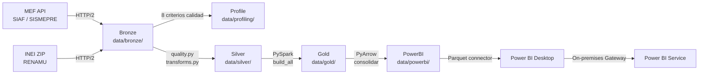
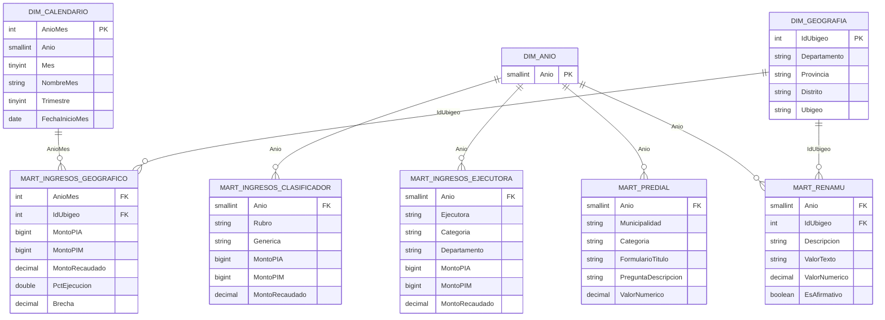

# Arquitectura de Datos — EP-GDM-G6

## Resumen

Medallion Data Lakehouse para datos fiscales del gobierno peruano (MEF/INEI) con exposición
de marts analíticos en formato Parquet optimizado para Power BI. Tecnología: PySpark 4.1 +
PyArrow 24. Sin Docker, sin base de datos, 100 % local.

---

## Fuentes de Datos

| Dataset | Fuente | Organismo | Granularidad | Años |
|---------|--------|-----------|-------------|------|
| SIAF — Ingresos | MEF FS Datastore | MEF | Mensual | 2021-2024 |
| SISMEPRE — Predial | MEF FS Datastore | MEF | Anual | 2021-2024 |
| RENAMU — Indicadores | INEI ZIP | INEI | Anual | 2021-2024 |

---

## Flujo End-to-End



---

## Capas del Medallion

### Bronze — `data/bronze/`

Descarga cruda en parquet comprimido con zstd. Sin transformaciones.

| Archivo | Descripción |
|---------|-------------|
| `SIAF-{año}.parquet` | Ejecución presupuestal de ingresos por mes |
| `SISMEPRE-rentas_*.parquet` | Formularios, preguntas y respuestas prediales |
| `RENAMU-{año}.parquet` | Indicadores municipales anuales |

### Silver — `data/silver/`

15 dimensiones + 3 tablas de hechos con surrogate keys (Window.orderBy).

**Dimensiones:**

| Tabla | Clave | Descripción |
|-------|-------|-------------|
| DIM_TIEMPO | IdTiempo | Período mensual/anual |
| DIM_EJECUTORA | IdEjecutora | Municipios ejecutores + Categoría A-G |
| DIM_UBIGEO | IdUbigeo | Jerarquía geográfica (dpto/prov/dist) |
| DIM_NIVEL_GOBIERNO | IdNivelGobierno | Nacional / Regional / Local |
| DIM_SECTOR | IdSector | Sector del gobierno |
| DIM_PLIEGO | IdPliego | Pliego presupuestal |
| DIM_RUBRO | IdRubro | Rubro de financiamiento |
| DIM_TIPO_RECURSO | IdTipoRecurso | Tipo de recurso |
| DIM_FUENTE_FINANCIAMIENTO | IdFuenteFinanciamiento | Fuente de financiamiento |
| DIM_GENERICA | IdGenerica | Clasificador genérico (3 niveles) |
| DIM_ESPECIFICA | IdEspecifica | Clasificador específico (2 niveles) |
| DIM_ANIO_APLICACION | IdAnioAplicacion | Año de aplicación SISMEPRE |
| DIM_FORMULARIO_SISMEPRE | IdFormSismepre | Formulario predial |
| DIM_PREGUNTA_SISMEPRE | IdPreguntaSismepre | Preguntas prediales |
| DIM_PREGUNTA_RENAMU | IdPregunta | Indicadores RENAMU (unpivot) |

**Hechos:**

| Tabla | Clave de negocio | Métricas |
|-------|-----------------|---------|
| FACT_INGRESO | IdTiempo + 10 dims FK | MONTO_PIA, MONTO_PIM, MONTO_RECAUDADO |
| FACT_FORMULARIO_SISMEPRE | IdEjecutora + IdFormulario + IdPregunta | Respuestas tipadas |
| FACT_RENAMU | IdTiempo + IdUbigeo + IdPregunta | ValorTexto (unpivot) |

### Gold — `data/gold/`

Directorios Spark (múltiples `part-*.snappy.parquet`). Marts pre-agregados listos para análisis.

| Tabla | Filas aprox. | Descripción |
|-------|-------------|-------------|
| DIM_CALENDARIO | ~1 200 | AnioMes, Trimestre, FechaInicioMes |
| DIM_ANIO | 4 | Años disponibles |
| DIM_GEOGRAFIA | ~1 900 | Ubigeo + jerarquía geográfica |
| MART_INGRESOS_GEOGRAFICO | ~300K | PIA/PIM/Recaudado por ubigeo-mes |
| MART_INGRESOS_CLASIFICADOR | ~10K | Por año, Rubro, Genérica |
| MART_INGRESOS_EJECUTORA | ~30K | Por año, ejecutora y categoría A-G |
| MART_PREDIAL | ~200K | Respuestas SISMEPRE por municipio |
| MART_RENAMU | ~12.7M | Indicadores RENAMU por ubigeo-año |

### PowerBI — `data/powerbi/` ← NUEVO

Archivos parquet únicos consolidados con PyArrow. Sin Spark. Compatibles con el
conector nativo "Parquet" de Power BI.

```
data/powerbi/
├── DIM_CALENDARIO.parquet
├── DIM_ANIO.parquet
├── DIM_GEOGRAFIA.parquet
├── MART_INGRESOS_GEOGRAFICO.parquet
├── MART_INGRESOS_CLASIFICADOR.parquet
├── MART_INGRESOS_EJECUTORA.parquet
├── MART_PREDIAL.parquet
├── MART_RENAMU.parquet              (~68 MB, ~12.7M filas)
└── manifest.json
```

**Parámetros de escritura (PyArrow):**

| Parámetro | Valor | Razón |
|-----------|-------|-------|
| `compression` | `snappy` | Máxima compatibilidad con Power BI |
| `row_group_size` | 500 000 | Óptimo para consultas analíticas |
| `write_statistics` | `True` | Habilita predicate pushdown |
| `use_dictionary` | `True` | Eficiencia en columnas de baja cardinalidad |

---

## Modelo de Relaciones Power BI



---

## Estrategia de Actualización

| Aspecto | Decisión | Justificación |
|---------|----------|---------------|
| Modo refresh | Completo (overwrite) | < 100 MB, < 30 s de ejecución |
| Frecuencia | Anual (cuando MEF publica datos nuevos) | Fuentes publican años completos |
| Particionado | No (archivo único por tabla) | Volumen no lo justifica |
| Refresh incremental | No (requiere Premium/PPU) | Fuera de scope para este proyecto |

---

## Evaluación de Alternativas Descartadas

| Opción | Razón de descarte |
|--------|------------------|
| Parquet particionado por año | Añade complejidad a Power Query sin beneficio a 73 MB |
| Parquet particionado por entidad | Rompe consultas cross-entidad (las más comunes) |
| Delta Lake / Iceberg | Sin soporte nativo en Power BI Desktop sin conectores adicionales |
| Azure Blob / ADLS | Sin infraestructura cloud; scope académico local |

---

## Dependencias Técnicas

```
pyspark>=4.1.1    → Gold pipeline (Spark)
pyarrow>=24.0.0   → PowerBI export (sin Spark)
pydantic>=2.13.4  → Validación de configuración
httpx[http2]      → Descarga de fuentes MEF/INEI
pypdf>=6.13.2     → Parseo Anexo IV DS 003-2026-EF
Java 17 o 21      → Requerido por Spark
HADOOP_HOME       → winutils.exe + hadoop.dll (Hadoop 3.4.x)
```
